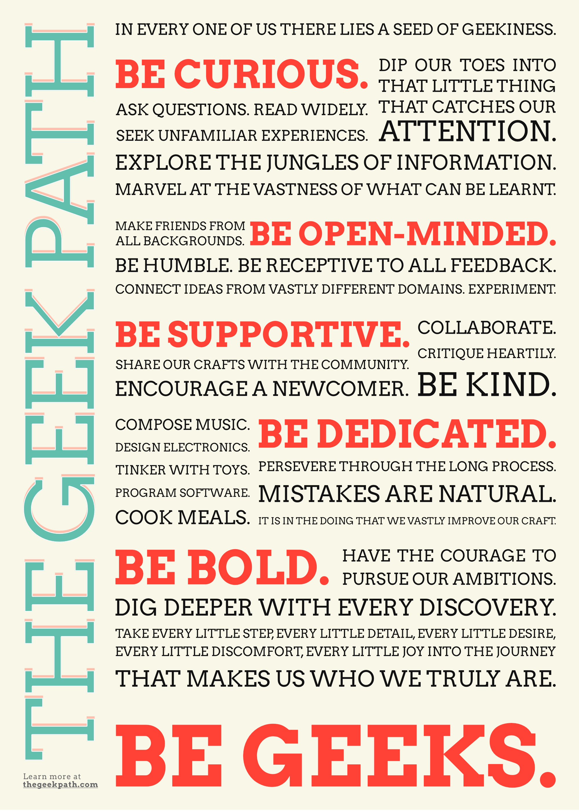

# The Geek Path

> Geek manifesto as codified by the grassroots community of engineers, designers and makers of Singapore.

Formats available:

- [PNG](artwork/thegeekpath.png)
- [SVG](artwork/thegeekpath.svg) ([unoptimized](artwork/thegeekpath.raw.svg) version, [editable](artwork/thegeekpath.editable.svg) version)
- [PDF](artwork/thegeekpath.pdf)

## Color scheme

- Background: `#F9F7E8`
- Green: `#62BFAD`
- Red: `#FF4136`

## Fonts

[Arvo](https://fonts.google.com/specimen/Arvo)

## Tools

- [Affinity Designer](https://affinity.serif.com/en-us/designer/)
- [SVGOMG](https://jakearchibald.github.io/svgomg/)

## License

[No Copyright](https://creativecommons.org/publicdomain/zero/1.0/): You can copy, modify, distribute and perform the work, even for commercial purposes, all without asking permission.

Social icons are from https://simpleicons.org/
